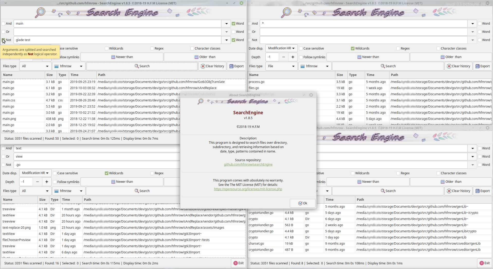

# Search Engine 1.9

*This program is designed to search files over directory, subdirectory, and retrieving information based on date/time, type, patterns contained in name. i'm using it as a replacement for native search function.*

##### Last update 2021-04-02

Take a look [here, H.F.M repositories](https://github.com/hfmrow/) for other useful linux softwares.

- If you just want to use it, simply download the *.deb* version under the [Releases](https://github.com/hfmrow/search-engine/releases) tab. 

- If you want to play inside code, see below "How to compile" section.

## How it's made

- Programmed with go language: [golang](https://golang.org/doc/) 
- GUI provided by [Gotk3 (gtk3 v3.22)](https://github.com/gotk3/gotk3), GUI library for Go (minimum required v3.16).
- I use homemade software: "Gotk3ObjHandler" to embed images/icons, UI-information and manage/generate gtk3 objects code from [glade ui designer](https://glade.gnome.org/). and "Gotk3ObjTranslate" to generate the language files and the assignment of a tooltip on the gtk3 objects (both are not published at the moment, in fact, they need documentations and, for the moment, I have not had the time to do them).

## Functionalities

- Search files based on patterns (contained in filename).
- Search files based on file type (all, files, dir, link).
- Search files based on date time (newer than, older than).
- Wildcard, regex, case sensitive, character classes can be used.
- Date/time display can be in human readable or classic format.
- Modification or last access date time display selection.
- And, or, not as logical operators may be used.
- Whole word functionality.
- Patterns can be splitted (at space char) to add multiples searches for each logical operator.
- Directory depth can be defined.
- Follow symlink directory option.
- History of previous pettern are recorded and can be erased as you wish
- Context menu to open file, open internet browser, open directory, copy path, delete selection(s).
- Column sort available.
- Export function is available to save the results list in txt format.
- Each function have his tooltip for explanations.

## Some pictures

*This is the main screen.*  
  

## How to compile

- Be sure you have golang installed in right way. [Go installation](https://golang.org/doc/install).

- Open terminal window and at command prompt, type: `go get github.com/hfmrow/search-engine`

- See [Gotk3 Installation instructions](https://github.com/gotk3/gotk3/wiki#installation) for gui installation instruction.

- To change gtk3 interface you need to use the **devMode = true** to disable embedding assets. see below ...

- To change language file you need to use another home made software, (not published actually). So don't change language file ...

- To Produce a stand-alone executable, you must change inside "main.go" file:
  
  ```go
    func main() {
        devMode = true
    ...
  ```
  
  into
  
  ```go
    func main() {
        devMode = false
    ...
  ```

This operation indicate that externals data (Image/Icons) must be embedded into the executable file.

### Os information (build using)

| Name                                                       | Version / Info / Name                          |
| ---------------------------------------------------------- | ---------------------------------------------- |
| GOLANG                                                     | V1.16.2 -> GO111MODULE="off", GOPROXY="direct" |
| DISTRIB                                                    | LinuxMint Xfce                                 |
| VERSION                                                    | 20                                             |
| CODENAME                                                   | ulyana                                         |
| RELEASE                                                    | #46-Ubuntu SMP Fri Jul 10 00:24:02 UTC 2020    |
| UBUNTU_CODENAME                                            | focal                                          |
| KERNEL                                                     | 5.8.0-48-generic                               |
| HDWPLATFORM                                                | x86_64                                         |
| GTK+ 3                                                     | 3.24.20                                        |
| GLIB 2                                                     | 2.64.3                                         |
| CAIRO                                                      | 1.16.0                                         |
| [GtkSourceView](https://github.com/hfmrow/gotk3_gtksource) | 4.6.0                                          |
| [LiteIDE](https://github.com/visualfc/liteide)             | 37.4 qt5.x                                     |
| Qt5                                                        | 5.12.8 in /usr/lib/x86_64-linux-gnu            |

- The compilation have not been tested under Windows or Mac OS, but all file access functions, line-end manipulations or charset implementation are made with OS portability in mind.  

## You got an issue ?

- Give information (as above), about used platform and OS version.
- Provide a method to reproduce the problem.

## Website

- [H.F.M Linux softwares](https://hfmrow.yo.fr/) Free linux software on Github. Sharing knowledge.
